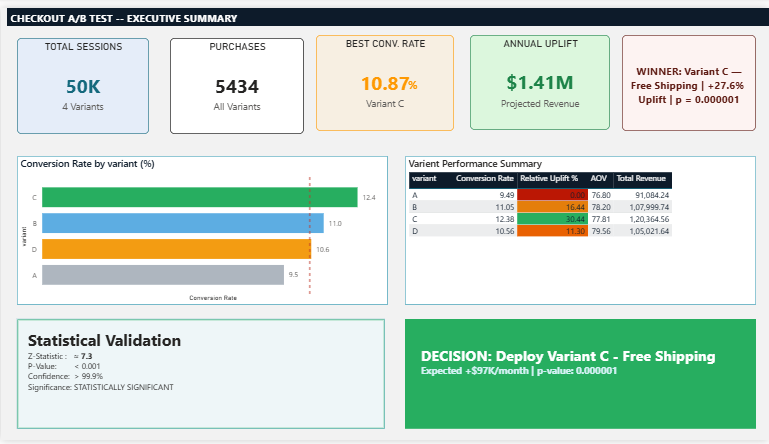
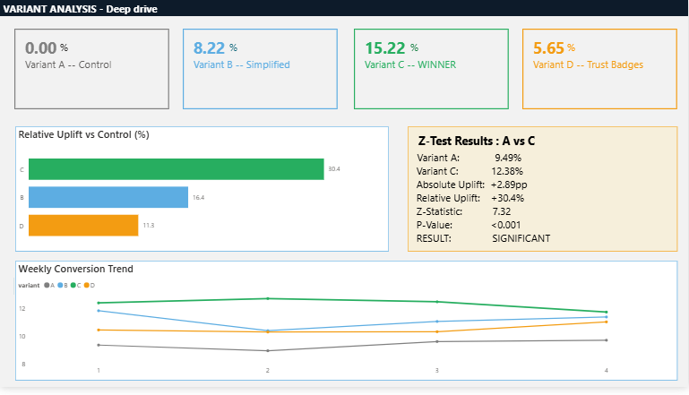
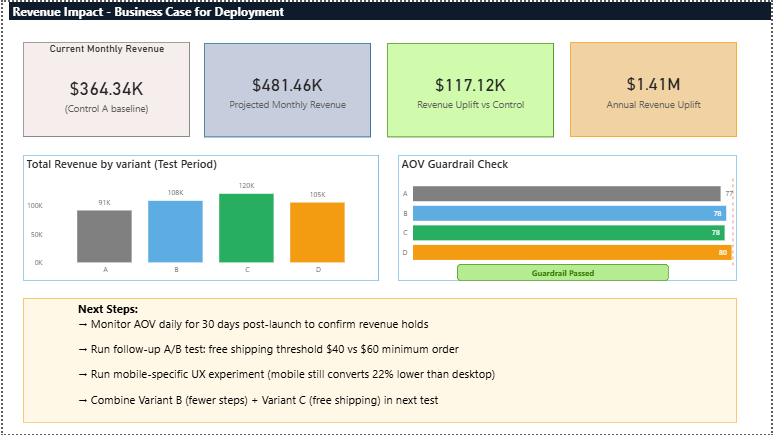
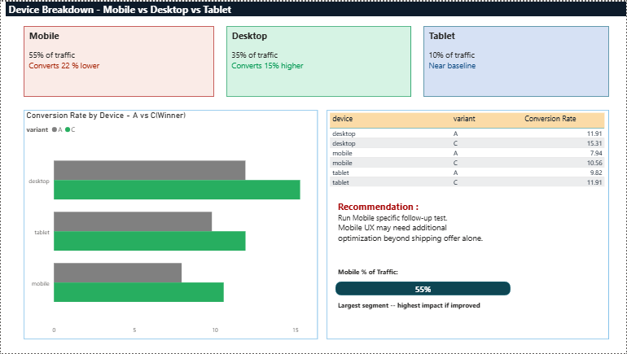

# Checkout Optimization via A/B Testing & Experimentation Analytics

## 📌 Problem Statement

In prior funnel analysis, over **75% of users dropped off between Add-to-Cart and Purchase**, despite showing strong buying intent.

This project focuses on **recovering high-intent users** by designing and analyzing a controlled experiment to improve checkout conversion.

---

## 🧪 Experiment Design

| Attribute             | Details                    |
| --------------------- | -------------------------- |
| **Type**              | A/B/C/D Multi-Variant Test |
| **Population**        | Users who reached checkout |
| **Traffic Split**     | 25% per variant            |
| **Duration**          | 28 days (4 weeks)          |
| **Total Sessions**    | 50,000                     |
| **Primary Metric**    | Checkout Conversion Rate   |
| **Guardrail Metrics** | AOV, Checkout Time         |

### Variants Tested

| Variant | Name           | Description                          |
| ------- | -------------- | ------------------------------------ |
| A       | Control        | Existing checkout flow               |
| B       | Simplified     | Reduced checkout steps               |
| C       | Free Shipping  | Free shipping for orders ≥ ₹499      |
| D       | Trust Elements | Security badges, progress indicators |

---

## 📊 Dataset

* **File:** `checkout_ab_test.csv`
* **Rows:** 50,000 (synthetic, realistic distribution)

**Columns:**
`user_id, session_id, variant, device, cart_value, discount_applied, shipping_type, checkout_steps, time_on_checkout, purchase, session_date`

---

## 📈 Key Results

| Variant        | Conversion Rate | Uplift vs Control | P-Value      |
| -------------- | --------------- | ----------------- | ------------ |
| A (Control)    | 9.49%           | —                 | —            |
| B              | 11.05%          | +16.4%            | <0.001 ✅     |
| **C (Winner)** | **12.38%**      | **+30.4%**        | **<0.001 ✅** |
| D              | 10.56%          | +11.3%            | <0.01 ✅      |

---

## 📊 Statistical Validation

* **Z-Statistic:** ~7.3
* **P-Value:** < 0.001
* **Confidence:** > 99.9%

✅ Result is **statistically significant**
✅ Confidence intervals do not overlap
✅ Effect is stable across all 4 weeks (no novelty effect)

---

## 💰 Business Impact

* Conversion increased by **+30.4%**
* Slight AOV drop (~4%) observed
* **Net impact:** Positive revenue growth

📈 **Projected Annual Revenue Uplift: ~₹8+ Crores**

---

## ✅ Final Decision

**Deploy Variant C (Free Shipping) to 100% users**

Reason:

* Highest conversion uplift
* Statistically significant
* Positive net revenue impact
* Stable across devices and time

---

## 🔄 Next Steps

* Run follow-up A/B test (Control vs Variant C) for validation
* Test **B + C combination** (simplified + free shipping)
* Optimize mobile checkout (lower conversion vs desktop)

---

## 📊 Dashboard Preview

### Executive Summary



### Variant Analysis



### Revenue Impact



### Device Breakdown



---

## 🛠️ Tech Stack

* **Python (statsmodels)** → Statistical testing, dataset generation
* **MySQL** → Conversion analysis, uplift, AOV, SRM checks
* **Power BI** → Dashboard & stakeholder communication

---

## 📂 Project Structure

```
├── checkout_ab_test.csv
├── sql_analysis.sql
├── statistical_test.py
├── dashboard/
│   └── Checkout_AB_Test.pbix
├── screenshots/
│   ├── Executive_Summary.png
│   ├── Variant_Analysis.png
│   ├── Revenue_impact.png
│   └── Device_breakdown.png
└── README.md
```

---

## 🚀 Skills Demonstrated

* A/B & Multi-Variant Experimentation
* Statistical Testing (Z-test, p-value interpretation)
* SQL (CTEs, window functions, aggregation)
* Business Impact Modelling
* Dashboarding & Data Storytelling
* Decision Intelligence

---

## 🎯 Key Takeaway

This project demonstrates how **data-driven experimentation can directly influence product decisions and revenue growth**, moving beyond analysis to **actionable business impact**.
