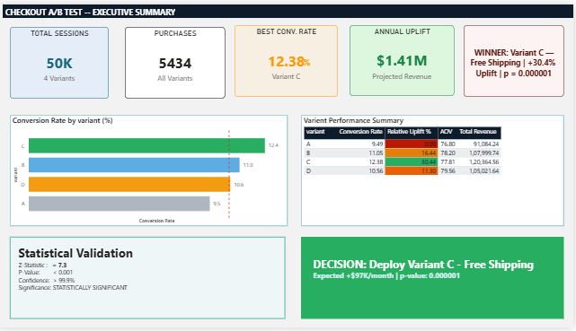
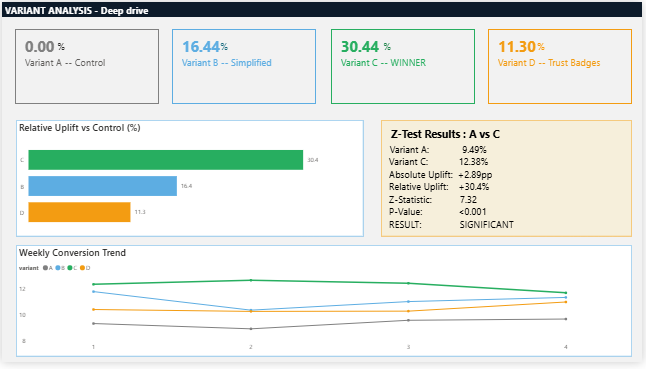

# Checkout Optimization — A/B Testing & Experimentation Analytics

## Background

This project came out of a funnel analysis I did earlier on an e-commerce dataset. The biggest finding there was that 77% of users who added something to their cart were leaving without buying — and mobile users were converting at roughly half the rate of desktop. Both pointed to the same root cause: checkout friction. People wanted to buy, something in the process was stopping them.

This project was built to test whether changing the checkout experience would actually fix that, and which type of change would matter most.

---

## Experiment Design

| Attribute | Details |
|---|---|
| Type | A/B/C/D Multi-Variant Test |
| Population | Users who reached checkout |
| Traffic Split | 25% per variant |
| Duration | 28 days (4 weeks) |
| Total Sessions | 50,000 |
| Primary Metric | Checkout Conversion Rate |
| Guardrail Metrics | Average Order Value, Checkout Time |

### Variants

| Variant | Name | What Changed |
|---|---|---|
| A | Control | Existing checkout — no changes |
| B | Simplified | Reduced number of checkout steps |
| C | Free Shipping | Free shipping for orders ≥ ₹499 |
| D | Trust Elements | Security badges + progress indicator added |

The test ran for four full weeks to capture complete weekday-weekend cycles and rule out any novelty effect from users reacting to a new design.

---

## Dataset

**File:** `checkout_ab_test.csv`  
**Rows:** 50,000 (synthetic, realistic distribution)  
**Columns:** `user_id`, `session_id`, `variant`, `device`, `cart_value`, `discount_applied`, `shipping_type`, `checkout_steps`, `time_on_checkout`, `purchase`, `session_date`

The dataset was generated using Python with realistic distributions — lognormal cart values, device-based conversion differences, and small noise terms so the data behaves like real checkout logs rather than round numbers.

---

## Results

### Conversion Rate by Variant

| Variant | Conversion Rate | Relative Uplift | P-Value |
|---|---|---|---|
| A — Control | 9.49% | — | — |
| B — Simplified | 11.05% | +16.4% | < 0.001 ✅ |
| C — Free Shipping | 12.38% | +30.4% | < 0.001 ✅ |
| D — Trust Elements | 10.56% | +11.3% | < 0.01 ✅ |

All three variants beat the control. Variant C was the clear winner.

### Statistical Validation (A vs C)

| Metric | Value |
|---|---|
| Z-Statistic | 7.32 |
| P-Value | < 0.001 |
| CI — Variant A | 8.99% to 10.01% |
| CI — Variant C | 11.81% to 12.96% |
| Confidence | > 99.9% |

The confidence intervals for A and C don't overlap at all, which visually confirms what the Z-test shows. The weekly trend was also stable across all four weeks — conversion didn't spike in week one and drop off, which rules out novelty effect.

### Device Breakdown

| Device | Traffic Share | Control (A) | Winner (C) |
|---|---|---|---|
| Mobile | 55% | 7.94% | 10.56% |
| Desktop | 35% | 11.91% | 15.31% |
| Tablet | 10% | 9.82% | 11.91% |

Variant C outperformed the control on every device. Mobile is the largest segment by traffic but still converts 22% lower than desktop even with Variant C — a mobile-specific follow-up experiment is the logical next step.

---

## Business Impact

| Metric | Value |
|---|---|
| Current Monthly Revenue (Control baseline) | $364,340 |
| Projected Monthly Revenue after rollout | $481,460 |
| Monthly Revenue Uplift | +$117,120 |
| Projected Annual Uplift | ~$1.41M |

Variant C caused a small AOV drop of about 4% — users who previously abandoned because of shipping costs are now completing checkout with slightly smaller baskets. The increase in conversion volume more than compensates. The AOV guardrail passed.

---

## Deployment Decision

**Ship Variant C — Free Shipping — to 100% of users.**

The case: highest conversion uplift of all three variants, statistically significant at > 99.9% confidence, positive net revenue impact even after the AOV decline, consistent results across all four weeks and all three device types.

---

## Next Steps

1. Run a follow-up A/B test (Control vs Variant C only) to reconfirm results in isolation
2. Test free shipping threshold options — ₹399 vs ₹499 vs ₹599 minimum order
3. Run a Variant B + C combination test — simplified steps and free shipping together
4. Design a dedicated mobile checkout experiment — mobile is 55% of traffic and still has the most room to improve

---

## Dashboard Preview

**Executive Summary**


**Variant Analysis**


**Revenue Impact**


**Device Breakdown**


---

## Tech Stack

- **Python** — pandas, numpy, scipy, statsmodels — statistical testing and dataset generation
- **MySQL** — conversion analysis, uplift calculations, SRM checks, window functions
- **Power BI** — dashboard and stakeholder communication

---

## Project Structure

```
├── checkout_ab_test.csv
├── sql_analysis.sql
├── statistical_test.ipynb
├── dashboard/
│   └── Checkout_AB_Test.pbix
├── screenshots/
│   ├── Executive_Summary.png
│   ├── Variant_Analysis.png
│   ├── Revenue_impact.png
│   └── Device_breakdown.png
└── README.md
```

---

## Skills Demonstrated

- Multi-variant experiment design (A/B/C/D)
- Statistical testing — Z-test for proportions, confidence intervals, p-value interpretation
- SQL — CTEs, window functions, conditional aggregation, SRM checks
- Business impact modelling — revenue uplift, guardrail metric analysis
- Dashboarding and data storytelling in Power BI
- Translating experiment results into a clear deployment decision
